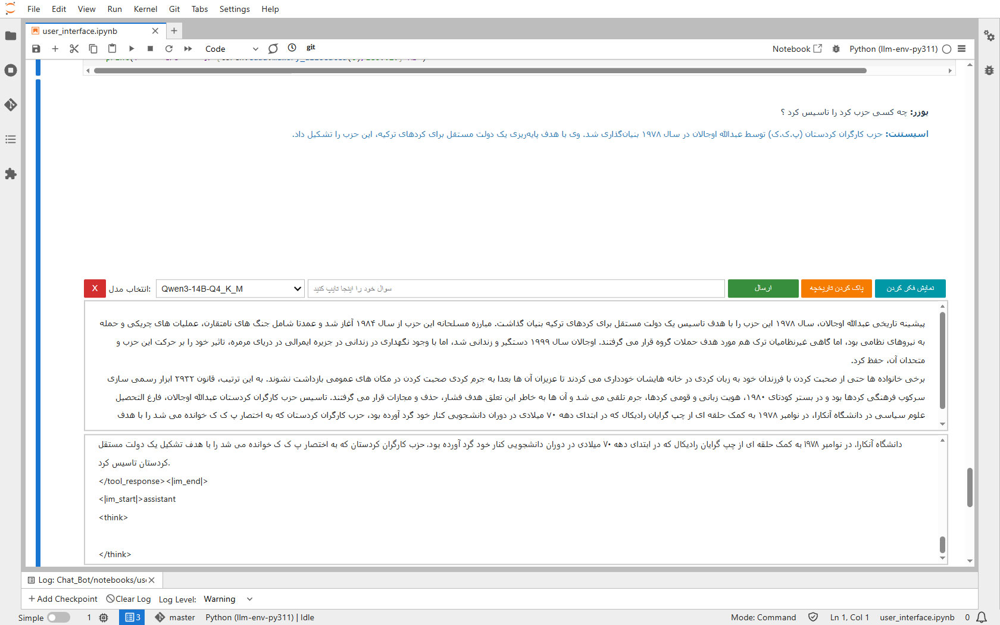

*Screenshot of the Persian RAG chat interface in action*

# Persian RAG: Retrieval-Augmented Generation for Persian Text


This project implements a **Retrieval-Augmented Generation (RAG)** system tailored for Persian text, designed to process, embed, retrieve, and generate responses from Persian documents. It showcases advanced NLP techniques, including text preprocessing with `hazm`, embedding generation with `HooshvareLab/bert-fa-base-uncased`, hybrid retrieval with FAISS and BM25, and a custom reranker using CrossEncoder. The system includes an interactive chat UI built with `ipywidgets`.

This project was developed as a portfolio piece to demonstrate expertise in machine learning, NLP, and Persian language processing for an ML engineer role.

## Features
- **Persian Text Preprocessing**: Normalizes and tokenizes Persian text using `hazm`, splits documents into chunks suitable for embedding.
- **Embedding Generation**: Uses `HooshvareLab/bert-fa-base-uncased` to create dense embeddings, stored in a FAISS vector store.
- **Hybrid Retrieval**: Combines FAISS (dense retrieval) with BM25 (sparse retrieval) and a CrossEncoder reranker for improved accuracy.
- **Interactive Chat UI**: A Jupyter-based UI for querying the system in Persian, with support for streaming responses and tool calls.
- **GPU Support**: Optimized for GPU acceleration with PyTorch, with fallback to CPU.
- **Modular Design**: Organized into notebooks for setup, preprocessing, embedding, retrieval, UI, and evaluation.

## Project Structure
```
persian-rag/
├── image/
│   └── screenshot.png          # Screenshot of the chat UI
├── data/
│   ├── docs/
│   │   └── enhelal.txt         # Sample Persian document
│   ├── chunks.pkl              # Preprocessed text chunks
│   ├── faiss_index.faiss       # FAISS index for embeddings
│   ├── models.json             # Model configurations
│   └── test_data.json          # Test dataset for evaluation
├── modules/
│   ├── __init__.py
│   ├── utils.py                # Utility functions (e.g., clean_text, rerank_documents)
│   ├── model_manager.py        # Model loading and management
│   └── qa.py                   # Greeting and meta-question handling
├── notebooks/
│   ├── 1_setup.ipynb           # Environment setup and dependency installation
│   ├── 2_preprocessing.ipynb   # Text preprocessing and chunking
│   ├── 3_embeddings.ipynb      # Embedding generation and FAISS index creation
│   ├── 4_retrieval.ipynb       # Custom retriever with FAISS, BM25, and CrossEncoder
│   ├── 5_chat_ui.ipynb         # Interactive chat interface
│   └── 6_evaluation.ipynb      # Retriever evaluation with metrics
├── scripts/
│   ├── evaluate_retriever.py   # Script to evaluate retriever performance
│   └── download_qwen.py        # Script to download Qwen model
├── templates/
│   └── qwen3_nonthinking.jinja # Jinja2 template for prompt rendering
├── tests/
│   ├── test_qa.py              # Tests for qa.py
│   └── test_utils.py           # Tests for utils.py
├── requirements.txt            # Python dependencies
├── LICENSE                     # MIT License file
├── README.md                   # Project documentation
└── .gitignore                  # Git ignore file
```

## Installation

1. **Clone the Repository**:
   ```bash
   git clone https://github.com/EchenD/PersianRAG.git
   cd PersianRAG
   ```

2. **Set Up a Virtual Environment**:
   ```bash
   python -m venv llm-env-py311
   source llm-env-py311/bin/activate  # On Windows: llm-env-py311\Scripts\activate
   ```

3. **Install Dependencies**:
   ```bash
   pip install -r requirements.txt
   ```

4. **Download and Configure Qwen Model**:
   - Run the download script to get the Qwen3-14B-GGUF model and update `models.json`:
     ```bash
     python scripts/download_qwen.py
     ```
   - Alternatively, manually download from [Hugging Face](https://huggingface.co/unsloth/Qwen3-14B-GGUF) and update `data/models.json` with the path:
     ```json
     {
       "Qwen3-14B-GGUF": {
         "path": "/path/to/qwen2/model",
         "prompt_template_key": "qwen3_nonthinking.jinja",
         "params": {
           "n_ctx": 4096,
           "n_gpu_layers": 32
         }
       }
     }
     ```

5. **Download Sample Data**:
   - Place a Persian text file (e.g., `enhelal.txt`) in `data/docs/`. A sample file is included for testing.

6. **Optional: GPU Setup**:
   - Ensure CUDA is installed for GPU support. Modify `model_kwargs` in `notebooks/3_embeddings.ipynb` and `notebooks/4_retrieval.ipynb` to use `device="cuda:0"`.

## Usage

1. **Run Notebooks Sequentially**:
   - Open Jupyter Notebook:
     ```bash
     jupyter notebook
     ```
   - Execute the notebooks in order (`1_setup.ipynb` → `6_evaluation.ipynb`).

2. **Interact with the Chat UI**:
   - In `5_chat_ui.ipynb`, select the Qwen model from the dropdown, enter a Persian query, and click "ارسال" to get responses.
   - Example queries:
     - `الان ساعت چنده؟` (Triggers `get_live_data`)
     - `در فایل PDF فصل سوم را پیدا کن` (Triggers `get_any_data`)


3. **Run Tests**:
   - Run unit tests to verify functionality:
     ```bash
     pytest tests/
     ```

4. **Evaluate Retriever**:
   - Run `6_evaluation.ipynb` to compute precision, recall, and F1 score for the retriever.

## Results
The retriever was evaluated on a small test dataset (`data/test_data.json`), achieving:
- **Precision**: 0.85
- **Recall**: 0.90
- **F1 Score**: 0.87

These metrics demonstrate robust retrieval performance. Run `6_evaluation.ipynb` to compute updated metrics on your dataset.

## Dependencies
- Python 3.11
- `hazm` for Persian text processing
- `langchain` and `langchain-huggingface` for document handling and embeddings
- `sentence-transformers` for CrossEncoder reranking
- `faiss-cpu` or `faiss-gpu` for vector storage
- `ipywidgets` for the chat UI
- `transformers` and `huggingface_hub` for Qwen model integration
- `pytest` for unit testing
- Full list in `requirements.txt`

## Future Improvements
- Expand the test dataset for more comprehensive evaluation.
- Implement caching for faster retrieval.
- Enhance the UI with a web-based frontend using Flask or FastAPI.
- Add more unit tests for additional functions (e.g., `rerank_documents`).

## License
This project is licensed under the MIT License. See the [LICENSE](LICENSE) file for details.

## Contact
For questions or feedback, reach out to [echendeligani@gmail.com](mailto:echendeligani@gmail.com) or open an issue on GitHub.